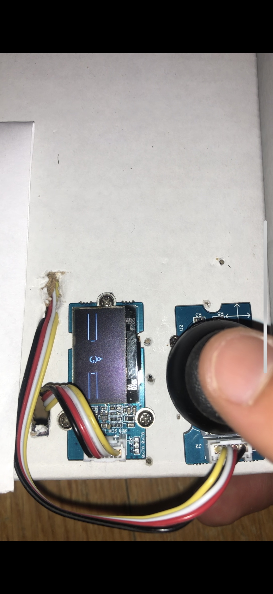

Author: Travis Clauson
Date: 15 August 2020

Summary: This is a simple version of the popular phone game Flappy Bird which is meant to run on a 128x64 OLED screen. Different screens can be used by changing the screen initialization in the code, but text/images may not fit if the resolution is different.
